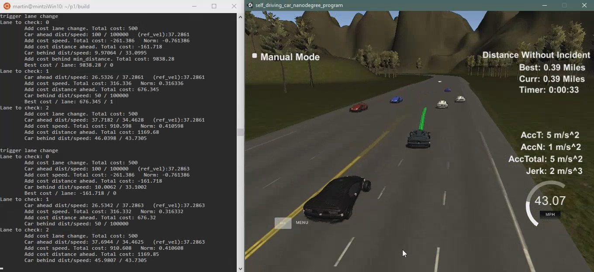
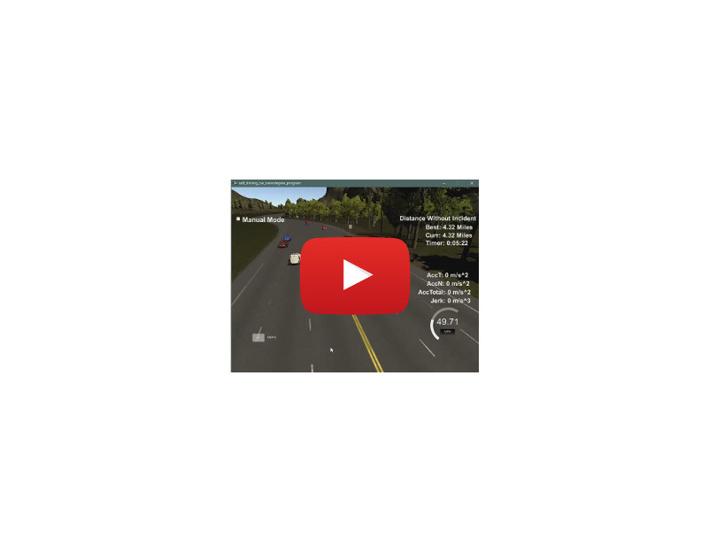

# CarND-Path-Planning-Project
Self-Driving Car Engineer Nanodegree Program



---

## Project Summary
The task was to build a path planner that successfully navigates a car through traffic on a highway. The car must be able to
* follow a smooth trajectory
* avoid crashes
* obey speed limit
* change lanes

The goal is to have the car drive at max speed (speed limit) as often as possible. As other cars are on the road that travel at various speeds, the controlled vehicle (EGO vehicle) has to change lanes in order to keep moving as quickly as possible. All actions of the car (acceleration, braking, lane change) have to be smooth to provide a pleasant experience for the passengers.

The program is executed without any arguments using the following command (for build instructions see Basic Build Instructions below):
```
./path_planning
```

A video of the car driving one lap in the simulator is uploaded to Youtube:

   [](https://youtu.be/-Ap98Lk72Sc)

## Implementation
The main parts of the implementation can be summarized as:
1. Determine EGO vehicle parameters (speed, previous path points, etc)
2. Check lane ahead for any obstructions. If any obstruction is observed, consider changing lanes and adjust speed. If obstruction is very close reduce speed.
3. Calculate cost for each possible lane.
4. Generate new trajectory based on best lane.

#### EGO vehicle parameters
Based on the last to positions (x/y, yaw) of the EGO vehicle, the next waypoint as well as the actual speed of the car can be calculated. The waypoint is important for the lane changing procedure. This procedure has an hysteresis built it to avoid lane changes while a lane change is already happening. This hysteresis is done by keeping track of the waypoint when a lane change was triggered and the number of waypoints since the lane change trigger waypoint.
The real speed is used to accurately adjust the speed to a possible upcoming car ahead that travels at slower speed.

#### Check lane ahead
The simulator provides sensor fusion data for all cars on the highway. This data includes position (x/y and Frenet s/d) that can be used to determine the speed and lane of each car as well as the distance to the EGO vehicle.

First step is to check if there's any car in front of the EGO vehicle. If that's the case in the car ahead is within a certain limit, a lane change is triggered and as a precaution the reference speed is set to match the speed of the car ahead. An additional safety check is implemented in case the car ahead is very close. In this case, the reference speed is set 5 mph lower in order to increase the distance between the cars. Next step is to adjust the EGO car's speed to the reference velocity.

#### Cost for each lane
If a lane change has been triggered and a lane change hasn't happened recently a cost for each possible lane is being calculated to determine the best lane the EGO should drive in. A triggered lane change is being skipped if a lane change has already occured within the last 3 waypoints.

The current status of the implementation is that only one lane change is permitted. That means, if the EGO vehicle is driving in the left or right lane (IDs 0 and 2) it has only 2 lane options (the lane it's in now and the one next to its lane). Only when the car is driving in the center lane (ID 1) the EGO vehicle has 3 lane options. This is to avoid rough lane changes and could be optimized later.

So, for each possible lane the sensor fusion data is being examined for the speed and distance of cars ahead and behind.

The cost for each lane consists of:
* lane change (penalty for changing lanes - car tries to stay in its lane)
* distance to vehicle ahead
* extra penalty if distance is very close (basiclly to block the lane totally because it's too dangerous)
* speed of vehicle ahead
* extra penalty if distance of car behind is very close (basiclly to block the lane totally because it's too dangerous)

Finally, the lane with the lowest cost is considered best and set as the new lane for the EGO vehicle.

#### Generate new trajectory
In the walkthrough video the method of choice was using a spline interpolation to generate smooth trajectories with minimal jerk. The path generated at each simulator time step has a size of 50 points. The distance between the points determines the speed of the EGO vehicle. First step is to generate a trajectory and then in a second step to re-align the points along this trajectory and space them evenly to match the desired speed.

The procedure to generate a trajectory is to supply the spline algorithm with 5 points and interpolate the points in between. The first 2 points are taken from the previous path (to allow a continuous drive) and the other 3 points are calculated from the current position but ahead of the EGO car at 30m, 60m and 90m in the best lane (see cost functions). This is resulting in a very smooth trajectory.

Next step is to re-align the trajectory path points to match the desired velocity. For simplification, the trajectory is considered to be limear (error is negligible). This simplification allows us to simply divide the line into evenly spaced fractions in relation to the desired speed and the simulator time step interval.

The new path always contains parts of the previously used trajectory in order to generate a continuous path.

## Future optimizations
The current status of the implementation runs smoothly around the track, however, the following improvements could be implemented for a better and safer experience:
* EGO car should change back to center lane if possible (to have rmore lane options)
* Consider average speed of all cars in each lane and choose the fastest one
* Sometimes, simulator controlled cars change lanes very dangerously (very quick and very close to the EGO car). This could be tracked by monitoring the acceleration in d-coordinates and trigger emergency braking if required.
* Cost functions can be optimized and probably more aggressive.
* Add double lane change (2 lanes in one go).

## Final Result
The current implementation drives the car smoothly around the track at speed limit. It changes lanes whenever required and possible by calculating cost for each lane and finally choosing the best one. However, the current cost calculation is quite conservative and tries to stay within its lane if the benefit is not big enough (this can be seen when the others cars are driving at nearly similar speed).

A video of the car driving one lap in the simulator is uploaded to Youtube:

   [](https://youtu.be/-Ap98Lk72Sc)

---

## Simulator.
You can download the Term3 Simulator which contains the Path Planning Project from the [releases tab (https://github.com/udacity/self-driving-car-sim/releases).

## Goals
In this project your goal is to safely navigate around a virtual highway with other traffic that is driving +-10 MPH of the 50 MPH speed limit. You will be provided the car's localization and sensor fusion data, there is also a sparse map list of waypoints around the highway. The car should try to go as close as possible to the 50 MPH speed limit, which means passing slower traffic when possible, note that other cars will try to change lanes too. The car should avoid hitting other cars at all cost as well as driving inside of the marked road lanes at all times, unless going from one lane to another. The car should be able to make one complete loop around the 6946m highway. Since the car is trying to go 50 MPH, it should take a little over 5 minutes to complete 1 loop. Also the car should not experience total acceleration over 10 m/s^2 and jerk that is greater than 50 m/s^3.

### The map of the highway is in data/highway_map.txt
Each waypoint in the list contains  [x,y,s,dx,dy] values. x and y are the waypoint's map coordinate position, the s value is the distance along the road to get to that waypoint in meters, the dx and dy values define the unit normal vector pointing outward of the highway loop.

The highway's waypoints loop around so the frenet s value, distance along the road, goes from 0 to 6945.554.

## Basic Build Instructions

1. Clone this repo.
2. Make a build directory: `mkdir build && cd build`
3. Compile: `cmake .. && make`
4. Run it: `./path_planning`.

Here is the data provided from the Simulator to the C++ Program

#### Main car's localization Data (No Noise)

["x"] The car's x position in map coordinates

["y"] The car's y position in map coordinates

["s"] The car's s position in frenet coordinates

["d"] The car's d position in frenet coordinates

["yaw"] The car's yaw angle in the map

["speed"] The car's speed in MPH

#### Previous path data given to the Planner

//Note: Return the previous list but with processed points removed, can be a nice tool to show how far along
the path has processed since last time. 

["previous_path_x"] The previous list of x points previously given to the simulator

["previous_path_y"] The previous list of y points previously given to the simulator

#### Previous path's end s and d values 

["end_path_s"] The previous list's last point's frenet s value

["end_path_d"] The previous list's last point's frenet d value

#### Sensor Fusion Data, a list of all other car's attributes on the same side of the road. (No Noise)

["sensor_fusion"] A 2d vector of cars and then that car's [car's unique ID, car's x position in map coordinates, car's y position in map coordinates, car's x velocity in m/s, car's y velocity in m/s, car's s position in frenet coordinates, car's d position in frenet coordinates. 

## Details

1. The car uses a perfect controller and will visit every (x,y) point it recieves in the list every .02 seconds. The units for the (x,y) points are in meters and the spacing of the points determines the speed of the car. The vector going from a point to the next point in the list dictates the angle of the car. Acceleration both in the tangential and normal directions is measured along with the jerk, the rate of change of total Acceleration. The (x,y) point paths that the planner recieves should not have a total acceleration that goes over 10 m/s^2, also the jerk should not go over 50 m/s^3. (NOTE: As this is BETA, these requirements might change. Also currently jerk is over a .02 second interval, it would probably be better to average total acceleration over 1 second and measure jerk from that.

2. There will be some latency between the simulator running and the path planner returning a path, with optimized code usually its not very long maybe just 1-3 time steps. During this delay the simulator will continue using points that it was last given, because of this its a good idea to store the last points you have used so you can have a smooth transition. previous_path_x, and previous_path_y can be helpful for this transition since they show the last points given to the simulator controller with the processed points already removed. You would either return a path that extends this previous path or make sure to create a new path that has a smooth transition with this last path.

## Tips

A really helpful resource for doing this project and creating smooth trajectories was using http://kluge.in-chemnitz.de/opensource/spline/, the spline function is in a single hearder file is really easy to use.

---

## Dependencies

* cmake >= 3.5
 * All OSes: [click here for installation instructions](https://cmake.org/install/)
* make >= 4.1
  * Linux: make is installed by default on most Linux distros
  * Mac: [install Xcode command line tools to get make](https://developer.apple.com/xcode/features/)
  * Windows: [Click here for installation instructions](http://gnuwin32.sourceforge.net/packages/make.htm)
* gcc/g++ >= 5.4
  * Linux: gcc / g++ is installed by default on most Linux distros
  * Mac: same deal as make - [install Xcode command line tools]((https://developer.apple.com/xcode/features/)
  * Windows: recommend using [MinGW](http://www.mingw.org/)
* [uWebSockets](https://github.com/uWebSockets/uWebSockets)
  * Run either `install-mac.sh` or `install-ubuntu.sh`.
  * If you install from source, checkout to commit `e94b6e1`, i.e.
    ```
    git clone https://github.com/uWebSockets/uWebSockets 
    cd uWebSockets
    git checkout e94b6e1
    ```

## Editor Settings

We've purposefully kept editor configuration files out of this repo in order to
keep it as simple and environment agnostic as possible. However, we recommend
using the following settings:

* indent using spaces
* set tab width to 2 spaces (keeps the matrices in source code aligned)

## Code Style

Please (do your best to) stick to [Google's C++ style guide](https://google.github.io/styleguide/cppguide.html).

## Project Instructions and Rubric

Note: regardless of the changes you make, your project must be buildable using
cmake and make!


## Call for IDE Profiles Pull Requests

Help your fellow students!

We decided to create Makefiles with cmake to keep this project as platform
agnostic as possible. Similarly, we omitted IDE profiles in order to ensure
that students don't feel pressured to use one IDE or another.

However! I'd love to help people get up and running with their IDEs of choice.
If you've created a profile for an IDE that you think other students would
appreciate, we'd love to have you add the requisite profile files and
instructions to ide_profiles/. For example if you wanted to add a VS Code
profile, you'd add:

* /ide_profiles/vscode/.vscode
* /ide_profiles/vscode/README.md

The README should explain what the profile does, how to take advantage of it,
and how to install it.

Frankly, I've never been involved in a project with multiple IDE profiles
before. I believe the best way to handle this would be to keep them out of the
repo root to avoid clutter. My expectation is that most profiles will include
instructions to copy files to a new location to get picked up by the IDE, but
that's just a guess.

One last note here: regardless of the IDE used, every submitted project must
still be compilable with cmake and make./

## How to write a README
A well written README file can enhance your project and portfolio.  Develop your abilities to create professional README files by completing [this free course](https://www.udacity.com/course/writing-readmes--ud777).

